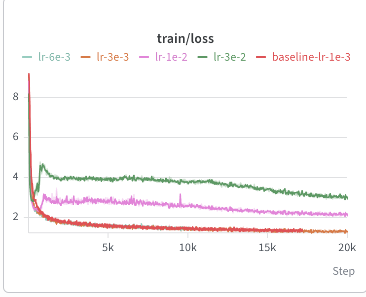

2.1
a) The null character, '\x00'.
b) It's string representation is "'\\x00'" but when you print it you just see blank. 
c) In text, it renders invisibly when printed to stdout even when the character exists in the string. 

2.2
a) For common strings (in English, which is most of the internet), UTF-8 encodings generally require fewer bits of data than UTF-16. This is because most common characters can be represented with one byte of data, so occassionally paying many bytes to represent rare characters is a worthwhile cost compared to representing every character with 2 or 4 bytes.
b) This function assumes every character can be represented with exactly one byte in UTF-8. It fails for: 
decode_utf_8_bytes_to_str_wrong("😀".encode("utf-8"))
Traceback (most recent call last):
  File "<stdin>", line 1, in <module>
  File "<stdin>", line 1, in decode_utf_8_bytes_to_str_wrong
UnicodeDecodeError: 'utf-8' codec can't decode byte 0xf0 in position 0: unexpected end of data
c) bytes([255, 255]) does not decode because no utf-8 unicode character starts with 255. utf-8 has a scheme for showing how many bytes the character requires, and 11111111 is not a valid prefix since there are no 8 byte characters. We can also have a valid start byte but invalid continuation byte.

2.5a) Tokenization takes 40 seconds with a peak memory usage of 8435 MB. The longest token is b' accomplishment'. Tinystories is made up nearly entirely of English words, so the pretokens generated by the regex are all just English words. Tinystories is formulaic and repetitive with perfect grammar and spelling, so it's plausible accomplishment rather than some artifact like a part of a url is the longest token. 

b) Pretokenization takes the vast majority of that time: 39 seconds.

a) The longest token is b'\xc3\x83\xc3\x82\xc3\x83\xc3\x82\xc3\x83\xc3\x82\xc3\x83\xc3\x82\xc3\x83\xc3\x82\xc3\x83\xc3\x82\xc3\x83\xc3\x82\xc3\x83\xc3\x82\xc3\x83\xc3\x82\xc3\x83\xc3\x82\xc3\x83\xc3\x82\xc3\x83\xc3\x82\xc3\x83\xc3\x82\xc3\x83\xc3\x82\xc3\x83\xc3\x82\xc3\x83\xc3\x82'. This is mojibake which can plausibly be contained in web scrapes, and mojibake creates repetitive, common patterns that are favored by the BPE tokenizer.

b) tinystories vocabulary is mostly just common english words, while owt has a much wider variety of tokens including some that are not very readable in english. However, the bulk of the tokens for both are English words. 

2.7a)
tinystories compression ratio: 4.059605488850772
owt compression ratio: 4.596554415030914

b) owt_cross compression ratio: 3.190849237436453, lower than the tinystories compression ratio. tinystories tokenizer is optimized to produce the maximum number of byte pair merges over the tinystories dataset, but the owt dataset is qualitatively different (urls, mojibake) so that same tokenizer achieves a lower compression ratio.

c) Tinystories validation: 21.5 MB/1.89 s = 11.43 MB/s. The Pile would take about 20 hours. 

d) uint16 is fine because all tokens are integers between 0 and 32,000 (32,000 for our OWT tokenizer, 10,000 for our tinystories one).

3.5a) Substituting values into d_model(2vocab_size + num_layers(4d_model + 3d_ff + 2) + 1), there are 1,640,452,800 parameters. fp32 for parameters means 4 bytes per parameter, or 6.56 GB to load the weights. 
b) Look at comments in module.py for the derivation of FLOPs for matrix multiplies. Total FLOPs come from substituting values into 2b*context_length*d_model(num_layers*(4d_model + 2context_length + 3d_ff) + vocab_size), which is 3,516,769,894,400 or 3.52 teraflops. 
c) SwGLU FFN requires the most FLOPs, with attention Q/K/V/O projections requiring the second most. 
d) As model size increases, the output projection (lm_head) becomes a smaller portion of total FLOPs per forward pass while feed forward becomes a larger portion of total FLOPs per forward pass.

Shares across all four sizes
Component	Small	Medium	Large	XL
Q/K/V/O projections	19.9%	24.8%	27.0%	28.6%
Scaled dot-product attention	13.3%	12.4%	10.8%	9.2%
SwiGLU FFN	39.8%	50.1%	54.8%	57.5%
lm_head	27.1%	12.7%	7.4%	4.7%

e) Total FLOPs increases 38x, which is consistent with attention FLOPs scaling quadratically with context length. Scaled dot product attention takes up dramatically more % of the total FLOPs while everything else decreases. 

Component	T = 1,024	T = 16,384
Q/K/V/O projections	28.6%	12.1%
Scaled dot-product attention	9.2%	61.7%
SwiGLU FFN	57.5%	24.2%
lm_head	4.7%	2.0%
Total FLOPs	3.5168e12	1.3358e14 (38× more)

4.2) For lr=1e1, our baseline, loss decays over 10 iterations. For lr=1e2, loss decays faster than baseline, and reaches a value very close to 0 within 10 iterations. For lr=1e3, loss grows over the 10 iterations, diverging. 

4.3a) 
Activations: 4·b·t · [ num_layers · (56/3 · d_model + 2·t·num_heads) + d_model + 2·vocab_size ]
Parameters: 4 * d_model(2vocab_size + num_layers(12d_model + 2) + 1)
Gradients: 4 * d_model(2vocab_size + num_layers(12d_model + 2) + 1)
Optimizer state: 8 * d_model(2vocab_size + num_layers(12d_model + 2) + 1)
Total: sum of all of them

b) 16,356,614,144·b + 26,168,601,600 bytes = (16.36 * b + 26.17) GB. we need b < 4 to fit in 80 GB of memory. 
c) The FLOPs are dominated by the weight decay step, calculating the two moments, and the final parameter update.
p.data *= (1 - lr * weight_decay): 1
m = b1 * m + (1 - b1) * grad: 3
v = b2 * v + (1 - b2) * grad ** 2: 4
p.data -= lr_adj * m / (torch.sqrt(v) + eps): 5
So that adds up to 13 FLOPs per parameter.

d) Forward pass FLOPs: 2b*context_length*d_model(num_layers*(4d_model + 2context_length + 3d_ff) + vocab_size). Backward pass FLOPs: 4b*context_length*d_model(num_layers*(4d_model + 2context_length + 3d_ff) + vocab_size). AdamW optimizer FLOPs are negligible. This leads to 10,550,309,683,200 · b FLOPs per step. For 400K steps and batch size 1024, that is 4,321,406,846,238,720,000,000 ≈ 4.32 × 10^{21} FLOPs for training. Total seconds: 4,321,406,846,238,720,000,000 / (495 teraFLOPs/s * 0.5) ≈ 17,460,230 seconds ~ 202 days on a single H100. 

7.2.3a) Learning rate strategy: Given the two B200-hour budget, we will tune only the peak learning rate using a coarse logarithmic search by factors of three for five different learning rates. 1e-3 had good stability, so we will start by increasing the learning rates, running 3e-2, 1e-2, 3e-3.

b) 3e-2 and 1e-2 diverged and 3e-3 did not so I also run 6e-3 to get closer to the edge of stability. 3e-3 and 6e-3 performed better than 1e-3 and 1e-2 was the divergence point. 6e-3 slightly outperformed 1e-2.

7.2.3b) Peak memory usage during training: 0.34 + 0.087 * b GB.
A B200 has 180 GB of RAM, so we can do a max batch size of b = 1917. We will test with
b = 1, 16, 64, 128, 512, 1024 for 5,000 iterations.

BATCH_SIZE=1; uv run python -m cs336_basics.training_together --modal --batch-size "$BATCH_SIZE" --run-name "b${BATCH_SIZE}" --checkpoint-path "b${BATCH_SIZE}.pkl" --iters 5000

Larger batch sizes take significantly longer per step, but tend to decrease training and validation loss faster per step. Very small batch size lead to very noisy variation in loss per step. 

7.2 - generate)
decoding.decode_str("jack and jill ran up the hill", model, "tinystories_vocab.pkl", "tinystories_merges.pkl")
'. He was collecting rocks and inches long and steered at the hill. After a lot of work, he saw all the rocks and became a symbol of the hill. He was so amazed by it. After that, he wanted to go back in the maze he was scared of, but he started running. He stamped signs and shouted, "I\'m not really scared - I\'m just a dark and young hill".\nBut then the sun started to come out. It was a too hot and snowy time. Tom couldn\'t believe what he thought, but he was still scared of the dark. Suddenly, he heard a loud rumble of harsh wind outside his house. \nThe rainbow spread through the air, and Tom felt like it was going to turn into two rooms! He knew he\'d never be in the maze again. But he was determined to come back soon. He jumped into his new room and stopped smiling.\n<|endoftext|>'

Generally, the text seems quite coherent and sounds like something you'd get out of the tinystories dataset. Factors that affect quality: (1) the coherence of the initial prompt.

7.3)

